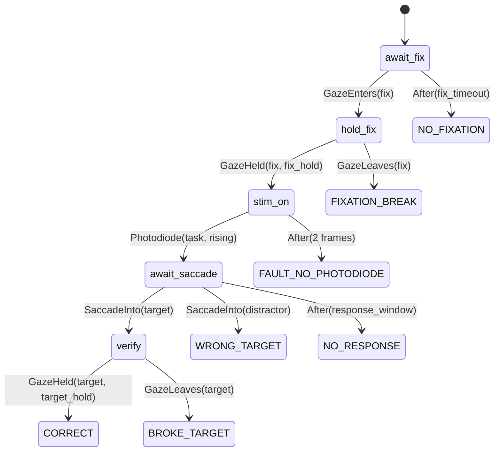

# S1 — Task model and authoring API

- **Status:** proposed, for PI review
- **Date:** 2026-08-31
- **Parent:** `2026-08-31-controller-architecture-design.md` §5; ADR-0006
- **Settles:** the parent's open question 1 (escape-hatch strictness), by bake-off

Every code block below is **illustrative, not shipped**. No code lands before M0
(CLAUDE.md). Names are chosen to make the comparison legible and are not a frozen API.

---

## 1. What this spec decides

ADR-0006 established the split — within-trial logic as declarative data, between-trial logic
as ordinary Python, represented as Python declarations — and deferred one question: **how
strict is the within-trial layer about escape hatches into arbitrary code?**

That question was deferred deliberately, because you were right to balk at answering it in
the abstract. §6 answers it by writing two real tasks in both forms and comparing what
review actually feels like. §7 is what the comparison showed, including the place my prior
was wrong.

---

## 2. The within-trial vocabulary

Four categories. Each starts minimal and grows only when a second task needs a member
(P2) — a vocabulary is an abstraction and earns its place the same way.

### 2.1 States

A state has entry actions, exit actions, and guarded transitions. It never has a body: the
task does not own the frame loop.

**Every state must be able to leave.** A state whose transitions cannot all be shown to
terminate is a load-time error unless it declares `unbounded=True` — which free-viewing
epochs do, deliberately and visibly.

### 2.2 Guards

| Guard | Fires on |
|---|---|
| `After(duration)` | elapsed time from state entry |
| `GazeEnters(window)` / `GazeLeaves(window)` | window crossing, staleness-aware (P6) |
| `GazeHeld(window, duration)` | continuous hold, with the grace policy from S5 |
| `SaccadeOnset()` / `SaccadeInto(window)` | online saccade detection, versioned component |
| `Photodiode(patch, edge)` | **physical** stimulus onset or a frame edge, via the comparator inputs |
| `ChairStill()` / `ChairMoving()` | the `wl-shook` motion trigger |
| `Response(device, value)` | joystick, lever, touch |
| `NeuralThreshold(source, feature, op, value)` | tier-3 gating, from either feature source |

### 2.3 Actions

`Show` / `Hide` / `Update`, `Emit(code)`, `Reward(...)`, `TriggerStim(tier, ...)`,
`Token(+1 / -1)`, `PlaySound(...)`, `SetPersistent(...)`.

Reward and stimulation actions **name an entry in the bounded config; they never carry a
magnitude.** `Reward(P.reward_small)` resolves through the subject's ceiling; a task cannot
express `Reward(ml=5.0)` at all, because the type does not admit a number.

### 2.4 Stimuli

Declared in **cyclopean degrees with an optional disparity**, so a monocular task is the
zero-disparity case (S0 §5.2). Motion is a **deterministic function of parameters, seed and
frame index** — never a logged trajectory — so offline reconstruction is exact and the hot
path stays allocation-free. Gaze-contingency is a property of a stimulus
(`anchored_to="gaze"`), not a special code path.

---

## 3. Representation

Python declarations — dataclass/pydantic — in plain-text files. Three independent arguments
land on this, which is why ADR-0006 treats it as settled:

1. **Models write mainstream Python far better than a DSL with no training data**, and the
   closed vocabulary is what keeps generation grounded.
2. **Readable in a local IDE** was a stated requirement; Python declarations get autocomplete,
   type checking and jump-to-definition for free, which YAML and a bespoke text format do not.
3. **The same object is validated, rendered, simulated and diffed** without a parsing layer.

---

## 4. The between-trial surface

Ordinary Python, called at trial boundaries, outside the frame budget:

- condition selection and block progression (the scheduler, S8)
- staircases and adaptive parameter updates
- re-queue policy for aborted trials
- any computation that produces the *next* trial's parameters

It may read the running statistics the console plots and the scheduler share. It writes
parameters only through the validated path (parent §7.2), and by default may not write them
at all — the console and the external control API are the enabled writers.

---

## 5. The bake-off: two tasks

**Task A — fixation → detection.** The M6 first real task. Fixate, hold, a target appears at
one of six positions, saccade to it, hold, reward.

**Task B — adaptive difficulty.** Task A with contrast on a staircase and mini-blocks of held
eccentricity — chosen because it is the case most often claimed to need imperative code.

### 5.1 Task A, strict

```python
from wl_mllib.codes import EV, Outcome          # allocated, never invented

FIX    = FixPoint(at=(0, 0), size=0.3)
TARGET = Blob(at=P.target_position, size=1.0, contrast=P.contrast)

detection = Trial(states=[
    State("await_fix",
        enter=[Show(FIX), Emit(EV.FIX_ON)],
        go=[On(GazeEnters("fix"),        "hold_fix"),
            On(After(P.fix_timeout),      Outcome.NO_FIXATION)]),

    State("hold_fix",
        enter=[Emit(EV.FIXATION_ACQUIRED)],
        go=[On(GazeHeld("fix", P.fix_hold), "stim_on"),
            On(GazeLeaves("fix"),            Outcome.FIXATION_BREAK)]),

    State("stim_on",
        enter=[Show(TARGET), Emit(EV.STIMULUS_ON)],
        go=[On(Photodiode(TASK_PATCH, RISING), "await_saccade"),
            On(After(2 * FRAMES),               Outcome.FAULT_NO_PHOTODIODE)]),

    State("await_saccade",
        enter=[Hide(FIX)],
        go=[On(SaccadeInto("target"),     "verify"),
            On(SaccadeInto("distractor"), Outcome.WRONG_TARGET),
            On(After(P.response_window),  Outcome.NO_RESPONSE)]),

    State("verify",
        go=[On(GazeHeld("target", P.target_hold), Outcome.CORRECT),
            On(GazeLeaves("target"),               Outcome.BROKE_TARGET)]),
])
```

### 5.2 Task A, loose

```python
def run_trial(rig, P):
    rig.show(FIX); rig.emit(EV.FIX_ON)
    t0 = rig.now()
    while not rig.gaze_in("fix"):
        rig.flip()
        if rig.now() - t0 > P.fix_timeout:
            return Outcome.NO_FIXATION

    held = 0.0
    while held < P.fix_hold:
        rig.flip()
        if not rig.gaze_in("fix"):
            return Outcome.FIXATION_BREAK
        held += rig.frame_period

    rig.show(TARGET); rig.emit(EV.STIMULUS_ON); rig.hide(FIX)
    t0 = rig.now()
    while rig.now() - t0 < P.response_window:
        rig.flip()
        if rig.saccade_into("target"):
            return Outcome.CORRECT
        if rig.saccade_into("distractor"):
            return Outcome.WRONG_TARGET
    return Outcome.NO_RESPONSE
```

### 5.3 Task B — the part that actually differs

In the **strict** form, the trial is Task A unchanged. The staircase is between-trial Python:

```python
def next_trial(session, history):
    staircase = session.state["staircase"]
    staircase.update(history[-1].outcome is Outcome.CORRECT)
    return Params(contrast=staircase.value,
                  target_position=session.block.sample_position())
```

In the **loose** form it is the same function — because a staircase was never a within-trial
concern. **Task B turned out not to be a discriminating case at all**, which is itself the
finding: the argument that adaptive tasks need imperative trials confuses between-trial
adaptation with within-trial control.

---

## 6. What the review artifact looks like

The strict form renders. This is generated from `detection`, not drawn by hand:



Alongside it: a timeline of the nominal trial, a table of every event code with the state
that emits it, the resolved parameter set, and a simulation report. **That is what a PI
reviews.** The loose form renders nothing — review is reading the function.

---

## 7. What the comparison actually showed

Honestly, including where my prior was wrong.

| | Strict | Loose |
|---|---|---|
| Every wait has a timeout | **Guaranteed at load time** | By inspection; `hold_fix` above has none, and it took me three readings to notice |
| Every path reaches an outcome | Provable | Not provable |
| Renderable for review | Yes | No |
| Exhaustively simulatable | Yes — the guard set is finite | Only by running it |
| Photodiode confirmation | A guard like any other | Easy to omit; the loose version above **silently omits it**, and nothing complains |
| Hot-path discipline | Structural — the task has no loop | Per-author, unenforceable in review |
| Lines for Task A | 24 | 22 |
| Adaptive difficulty | Between-trial Python | Between-trial Python — **identical** |

Three things I did not expect:

**The loose version is not shorter.** I assumed the declarative form would cost verbosity and
buy safety. At this size it costs nothing; the imperative version spends on loop scaffolding
what the declarative one spends on structure.

**The loose version has two real defects, and I wrote them without noticing.** It has an
unbounded fixation-hold loop, and it drops the photodiode confirmation entirely. Both are the
exact errors a generated task would make, both read as fine, and both would have reached an
animal. That is P15 demonstrated rather than asserted.

**Task B did not discriminate.** The strongest argument for imperative trials — adaptive
difficulty — evaporates once condition generation lives between trials, where it always
belonged. I expected this to be the hard case and it was not a case at all.

### 7.1 What actually resists the declarative form

One thing, and it is narrow: **genuinely novel per-frame computation.** Retinal stabilisation
with a custom filter; a stimulus whose position is an arbitrary function of gaze history.
Everything else in the stated program — gaze contingency, saccade triggering, photodiode
gating, neural thresholds, token economies, free viewing — is a vocabulary member, because
each has many consumers and so meets P2's test outright.

---

## 8. The verdict on escape hatches

**A typed seam, and novelty is promoted into reviewed code.**

A task that needs behaviour the vocabulary lacks declares it **by name**:

```python
State("stabilise",
    enter=[Show(Grating(anchored_to=Custom("retinal_stabilisation")))],
    ...)
```

`retinal_stabilisation` resolves to a component in the framework's own source — typed,
unit-tested, reviewed like framework code, and versioned. The task file stays pure data; the
novelty lives where a human already looks.

Why not the two alternatives:

- **No escape hatch at all** would have been defensible on this evidence — the residue is
  genuinely tiny. Rejected because a novel paradigm would then block on framework work at
  exactly the moment the science wants to move, and that pressure is what makes people fork
  the framework.
- **Python permitted inside a trial** is rejected by §7's own numbers: the loose version's two
  defects were invisible on reading, cost nothing to write, and would have run. An escape
  hatch that is ergonomically free gets used by default, and every guarantee in this spec
  stops being true the first time it is.

**A task using a `Custom` component is flagged**, appears in the review artifact as such, and
goes on the human-review list beside the welfare-critical modules.

---

## 9. What is checkable at load time

The list is the justification for the whole design. All of it is mechanical:

1. Every event code exists in the `wl-mllib` allocation (S2).
2. Every state is reachable from the start state.
3. Every path reaches a terminal outcome.
4. Every wait has a timeout, or declares `unbounded=True`.
5. Every terminal state maps to an allocated outcome code.
6. Every parameter referenced is declared, typed, and in range.
7. No reward or stimulation action carries a magnitude — only a bounded-config reference.
8. Every stimulus is expressible in cyclopean degrees for the configured display mode.
9. Every `Custom` component resolves to a reviewed framework component.
10. No two transitions from one state can fire on the same frame without a declared priority.

Then, before an animal: **the simulation gate.** Thousands of synthetic trials asserting
outcome coverage, no state starvation, parameter ranges honoured, and no unreachable branch —
plus keyboard/mouse demo mode, which is how a human confirms in thirty seconds that the task
does what was asked.

---

## 10. Open items

| # | Item | Blocks |
|---|---|---|
| 1 | Transition priority: declared order, or explicit priority field | the checker's rule 10 |
| 2 | Whether `Outcome` is `wl-mllib`'s enum directly or a task-local alias | S2 allocation |
| 3 | How persistent (cross-trial) state is declared and versioned | token tasks, S8 |
| 4 | Whether the review artifact is rendered by the console or a CLI | S9 |
| 5 | Frame-accurate `Update` semantics for gaze-anchored stimuli | S4 |
